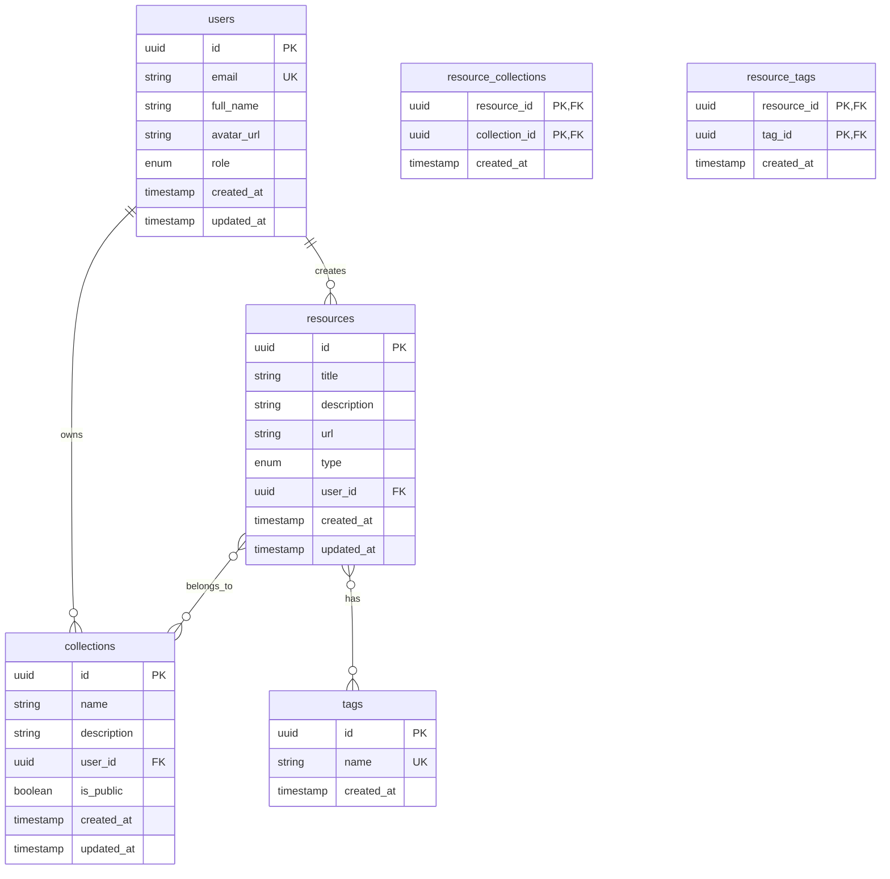

# Database Schema ER Diagram

## Entity Relationships

1. **Users**
   - One user can create many resources (1:N)
   - One user can own many collections (1:N)

2. **Resources**
   - Each resource belongs to one user (N:1)
   - Resources can belong to multiple collections (M:N)
   - Resources can have multiple tags (M:N)

3. **Collections**
   - Each collection belongs to one user (N:1)
   - Collections can contain multiple resources (M:N)

4. **Tags**
   - Tags can be associated with multiple resources (M:N)

## Key Features

- UUID primary keys for all tables
- Timestamps for creation and updates
- Row-level security enabled on all tables
- Cascading deletes for related records
- Unique constraints on email and tag names
- Enum types for user roles and resource types

## Security

- Row-level security (RLS) policies ensure:
  - Users can only access their own data
  - Public collections are viewable by all authenticated users
  - Resource access is controlled through collection membership
  - Tag access is controlled through resource ownership 